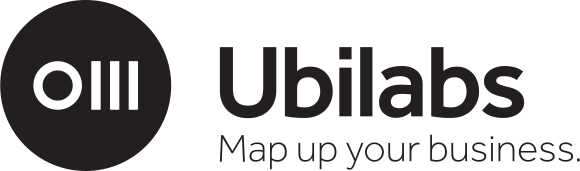

# [jscoderetreat Hamburg 12/2015](https://ti.to/jscoderetreat/jscoderetreat-hamburg-dec-2015)

Welcome to the jscoderetreat HH 2015!

## Getting started

Install nodejs (or use nvm or nave).

```shell
npm install jscoderetreat-hh
```

Open two terminals next to each other and run:

```shell
# The application
npm start
```
```shell
# The tests
npm test
```

## Backgrounds

We set up babeljs (transpiler), ava (testrunner) and nodemon (watcher) for an
easy start. Below you find the
documentation links as reference.
You could write your stuff in ES3/5/6/7 as you like.
If you want use some other tools feel free to modify the project.

* [Babeljs](https://babeljs.io/docs/learn-es2015/)
* [Ava](https://github.com/sindresorhus/ava#api)
* [Nodemon](https://github.com/remy/nodemon)


**Open your favorite editor and start hacking ;-)**

# Sponsors

##SinnerSchrader
[](https://sinnerschrader.com)
##Jimdo
[](http://de.jimdo.com/)
##Costa Digital
[](http://costadigital.io/)
[](http://costadigital.io/)
##Ubilabs
[](http://www.ubilabs.net/)

---
Inspired by [jscodereatreat](http://jscoderetreat.com/) and [coderetreat](http://coderetreat.org/)
